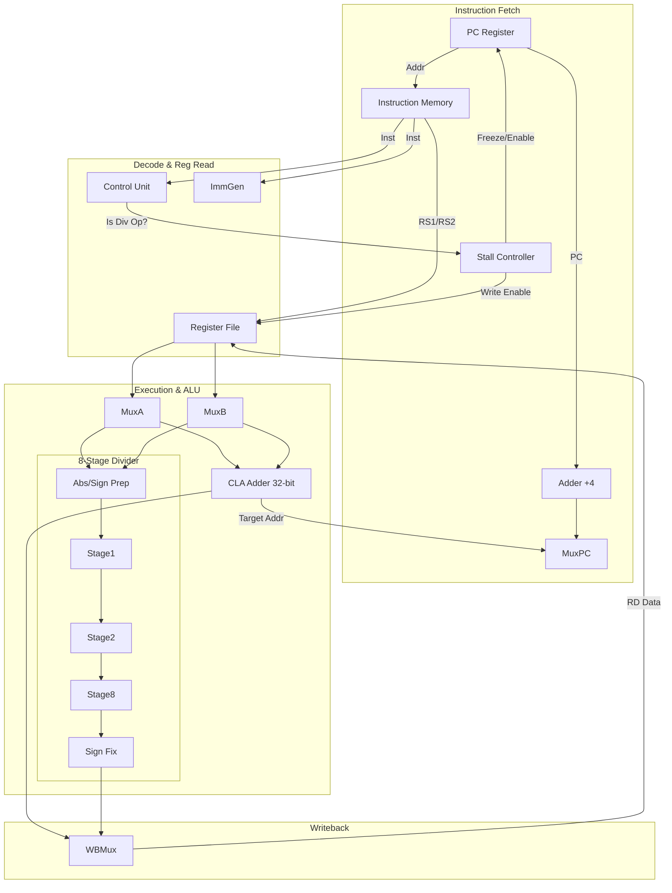

# RISC-V 32-bit Multi-Cycle Processor (RV32IM) with Pipelined Divider


## Table of Contents
- [1. Project Description](#project-desc)
- [2. Technologies Used](#tech-stack)
- [3. Key Features](#features)
- [4. Source Structure](#source-structure)
- [5. Architecture Flow](#architecture)
- [6. Installation & Simulation Guide](#installation)
- [7. Test Results](#results)

---

## <a id="project-desc"></a>1. Project Description

This project designs and implements an advanced **RISC-V 32-bit Processor** featuring a **Multi-Cycle Datapath** configuration. While standard instructions execute in a single cycle, complex arithmetic operations (specifically Division) utilize a multi-cycle latency approach to maximize throughput potential and timing closure.

Key architectural optimizations include:
- **Pipelined Arithmetic:** Integration of an **8-Stage Pipelined Divider**, managed by a hardware stall mechanism to synchronize with the main processor pipeline.
- **High-Speed Addition:** Utilization of a hierarchical **Carry Lookahead Adder (CLA)**.
- **Verification:** Comprehensive testing using **Cocotb** and **Verilator**, covering individual component pipelines and full-system instruction compliance.

## <a id="tech-stack"></a>2. Technologies Used

- **Design Language (RTL):** Verilog.
- **Simulation & Synthesis:** Verilator.
- **Verification Framework:** Cocotb (Python), Pytest.
- **Toolchain:** RISC-V GNU Toolchain (GCC, GDB).
- **Development Environment:** Linux (Ubuntu/WSL).

## <a id="features"></a>3. Key Features

### Hardware Architecture
- **RV32I Base ISA:** Supports all core instructions (`LUI`, `AUIPC`, `JAL`, `JALR`, Branch, Load/Store, ALU).
- **RV32M Extension (Multi-Cycle):**
  - **Multiplication:** Supports `MUL`, `MULH`, `MULHSU`, `MULHU` using a combinational multiplier.
  - **Division:** Supports `DIV`, `DIVU`, `REM`, `REMU` using an **8-stage pipeline**.
- **Stall Mechanism:** The Control Unit automatically freezes the PC and Register File write-enable for **8 clock cycles** during division operations (`div_counter < 8`) to wait for the pipelined result.
- **Advanced ALU Design:**
  - **CLA Adder:** A 32-bit adder built from 4-bit (`gp4`) and 8-bit (`gp8`) Lookahead Generation blocks for minimal carry delay.
  - **Pipelined Divider:** 8-stage Unsigned Divider module using iterative subtraction logic.

### Testbench System
- **Pipeline Verification:** Dedicated tests for the 8-stage divider latency and throughput.
- **Full System Verification:** Runs standard RISC-V tests and automatically handles the multi-cycle timing variations.

## <a id="source-structure"></a>4. Source Structure
The project directory structure is organized as follows:

```text
.
├── common/                      # Helper Python libraries (riscv_binary_utils, cocotb_utils)
├── DatapathMultiCycle.v         # Top-module: Processor with Stall Logic & Instruction Decoding
├── cla.v                        # Hierarchical Carry Lookahead Adder
├── DividerUnsignedPipelined.v   # 8-Stage Pipelined Divider Module
├── MemorySingleCycle.v          # Unified Instruction & Data Memory
├── testbench.py                 # Main verification script for the Processor
├── testbench_divider_pipelined.py # Unit tests for the Divider Pipeline
├── pytest.ini                   # Pytest configuration
└── mem_initial_contents.hex     # Default memory initialization content
```

## <a id="architecture"></a>5. Architecture Flow
The diagram below illustrates the Multi-Cycle data flow, highlighting the Stall Logic interaction with the Pipelined Divider:



## <a id="installation"></a>6. Installation & Simulation Guide
The project is developed on Linux (Ubuntu 20.04/22.04) or WSL2.

Step 1: Install System Dependencies
Run the following command to install Verilator (simulator), Python, and necessary helper libraries:
```bash
sudo apt update
sudo apt install -y autoconf automake autotools-dev curl libmpc-dev libmpfr-dev libgmp-dev gawk build-essential bison flex texinfo gperf libtool patchutils bc zlib1g-dev libexpat-dev ninja-build git cmake libglib2.0-dev libpixman-1-dev python3 python3-pip python3-venv verilator make

```
Step 2: Install RISC-V Toolchain (GCC)
You need the toolchain to compile C/Assembly code into RISC-V machine code.

Note: If you have already installed riscv-gnu-toolchain, skip this step. The toolchain compilation process may take 30 to 45 minutes.
```bash
cd ~
git clone [https://github.com/riscv-collab/riscv-gnu-toolchain.git](https://github.com/riscv-collab/riscv-gnu-toolchain.git)
cd riscv-gnu-toolchain
```

Config and Compile:
```bash
./configure --prefix=$HOME/riscv32 --with-arch=rv32im --with-abi=ilp32
make -j$(nproc)
```

Step 3: Config path 
Adding File Config:
```bash
echo 'export PATH=$HOME/riscv32/bin:$PATH' >> ~/.bashrc

source ~/.bashrc
```

Step 4: Set up Python Environment (Virtual Environment)
Navigate to your project directory before running:
```bash
python3 -m venv .venv
source .venv/bin/activate
pip install --upgrade pip
pip install cocotb cocotb-test pytest
```

Step 5: Activate the Environment and Run Verification
Open Terminal (WSL) inside the project directory and run:
```bash
source .venv/bin/activate
```
(If (.venv) appears at the start of the command prompt, it is successful)

Step 6: Run Tests
Run full Processor Tests (Full Simulation):
```bash
pytest -s testbench.py::runCocotbTestsProcessor
```

Run Unit Test for Register File:
```bash
pytest -s testbench.py::runCocotbTestsRegisterFile
```

## <a id="results"></a>7. Test Results

The verification system automatically compares the processor's state with the expected results. Below is the actual test execution log showing that all **52 tests** (including basic instructions, ALU operations, and Multi-Cycle Division tests) passed successfully.

Notably, the division tests (`riscvTest_043` to `riscvTest_046`) demonstrate higher simulation times due to the 8-cycle stall mechanism, confirming the multi-cycle behavior.

```text
*********************************************************************************************
** TEST                                 STATUS  SIM TIME (ns)  REAL TIME (s)  RATIO (ns/s) **
*********************************************************************************************
** testbench.testLui                     PASS          16.00           0.15        105.57  **
** testbench.testLuiAddi                 PASS          24.00           0.03        907.38  **
** testbench.testDivu                    PASS          56.00           0.03       1913.29  **
** testbench.test2Divu                   PASS         100.00           0.03       3063.96  **
** testbench.testDivuEtAl                PASS          68.00           0.03       2319.36  **
** testbench.testEcall                   PASS          20.00           0.03        764.17  **
** testbench.riscvTest_001               PASS         316.00           0.12       2729.06  **
** testbench.riscvTest_002               PASS         412.00           0.05       7753.73  **
** testbench.riscvTest_003               PASS        2092.00           0.16      12926.62  **
** testbench.riscvTest_004               PASS        2104.00           0.17      12526.54  **
** testbench.riscvTest_005               PASS        2100.00           0.16      13091.64  **
** testbench.riscvTest_006               PASS        2124.00           0.16      13385.18  **
** testbench.riscvTest_007               PASS        2200.00           0.16      13478.22  **
** testbench.riscvTest_008               PASS        2176.00           0.16      13344.89  **
** testbench.riscvTest_009               PASS        1988.00           0.15      13163.20  **
** testbench.riscvTest_010               PASS        2012.00           0.17      11723.57  **
** testbench.riscvTest_011               PASS        1980.00           0.15      12966.57  **
** testbench.riscvTest_012               PASS         944.00           0.09      10864.27  **
** testbench.riscvTest_013               PASS         972.00           0.09      10570.65  **
** testbench.riscvTest_014               PASS        1116.00           0.11       9961.64  **
** testbench.riscvTest_015               PASS        1176.00           0.11      10323.78  **
** testbench.riscvTest_016               PASS        1152.00           0.10      11400.64  **
** testbench.riscvTest_017               PASS         980.00           0.09      10571.04  **
** testbench.riscvTest_018               PASS        1100.00           0.10      10629.68  **
** testbench.riscvTest_019               PASS        1100.00           0.15       7244.70  **
** testbench.riscvTest_020               PASS        1988.00           0.16      12338.29  **
** testbench.riscvTest_021               PASS        1120.00           0.11       9752.85  **
** testbench.riscvTest_022               PASS        1316.00           0.14       9505.71  **
** testbench.riscvTest_023               PASS        1388.00           0.12      11104.90  **
** testbench.riscvTest_024               PASS        1488.00           0.12      12396.79  **
** testbench.riscvTest_025               PASS        1316.00           0.11      11625.31  **
** testbench.riscvTest_026               PASS        1416.00           0.12      12233.67  **
** testbench.riscvTest_027               PASS        1316.00           0.13      10455.44  **
** testbench.riscvTest_028               PASS         372.00           0.06       6695.56  **
** testbench.riscvTest_029               PASS         612.00           0.08       8058.46  **
** testbench.riscvTest_030               PASS         384.00           0.09       4094.27  **
** testbench.riscvTest_031               PASS        1164.00           0.18       6573.68  **
** testbench.riscvTest_032               PASS        1164.00           0.14       8325.50  **
** testbench.riscvTest_033               PASS        1228.00           0.23       5398.14  **
** testbench.riscvTest_034               PASS        1264.00           0.15       8233.80  **
** testbench.riscvTest_035               PASS        1284.00           0.15       8331.85  **
** testbench.riscvTest_036               PASS        1968.00           0.20       9940.26  **
** testbench.riscvTest_037               PASS        2180.00           0.22      10086.17  **
** testbench.riscvTest_038               PASS        2208.00           0.27       8080.87  **
** testbench.riscvTest_039               PASS        1988.00           0.34       5783.79  **
** testbench.riscvTest_040               PASS        1988.00           0.20       9809.36  **
** testbench.riscvTest_041               PASS        1988.00           0.18      11243.00  **
** testbench.riscvTest_042               PASS        1988.00           0.16      12370.62  **
** testbench.riscvTest_043               PASS         824.00           0.08      10276.90  **
** testbench.riscvTest_044               PASS         828.00           0.14       5762.78  **
** testbench.riscvTest_045               PASS         824.00           0.17       4745.38  **
** testbench.riscvTest_046               PASS         824.00           0.16       5184.95  **
**********************************************************************************************
** TESTS=52 PASS=52 FAIL=0 SKIP=0             64756.05            9.27       6986.73        **
**********************************************************************************************


